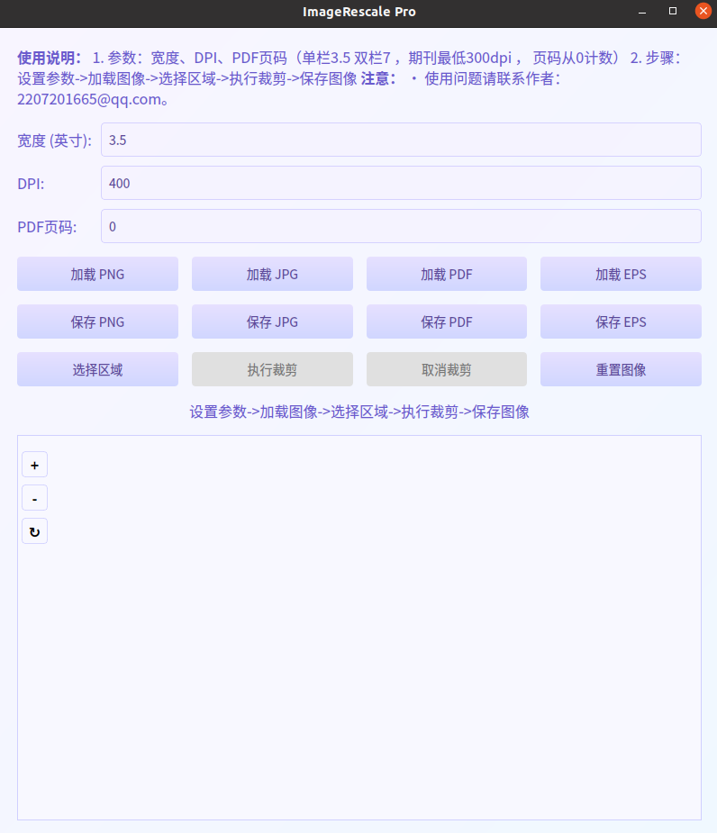

# ImageRescale
dist文件夹中有编译好文件，双击运行即可。

界面如下：



# 源码运行
需要依赖总结：

``` pip install PyQt5 pillow cairosvg pdf2image```

``` python3 ImageRescale_pyside.py ```

# 打包成程序（ubuntu）：

    pip install pyinstaller
    pyinstaller -F -w --hidden-import=PIL._tkinter_finder  ImageRescale_pyside.py --icon=icon.ico


